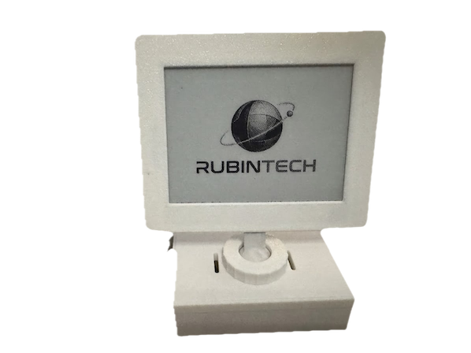
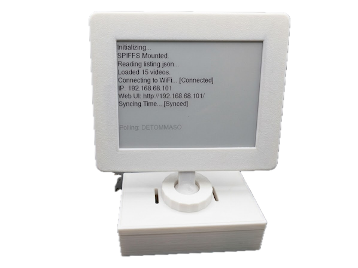
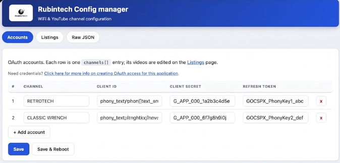
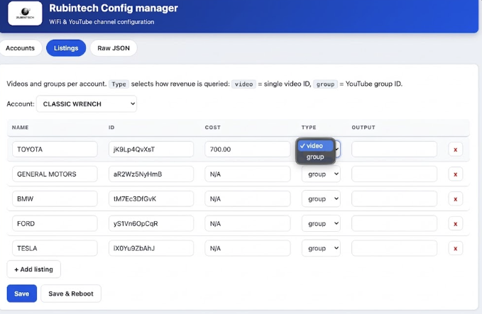
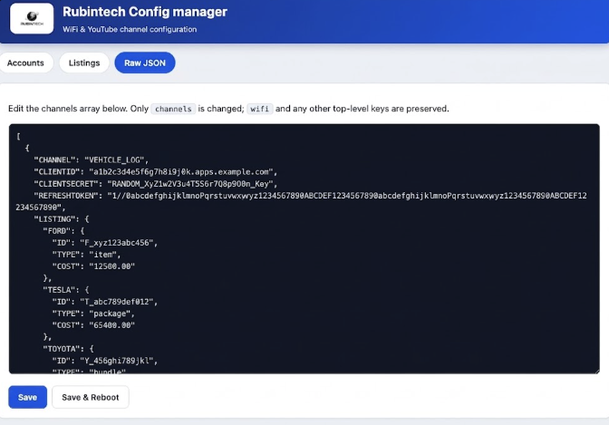

<table>
  <tr>
    <td valign="middle"></td>
    <td valign="middle"><h1>ESP32 E-Paper YouTube Revenue Tracker</h1></td>
  </tr>
</table>

This project uses an ESP32 and a Waveshare 4.2" E-Paper display to track estimated revenue for specific YouTube videos or channels using the YouTube Analytics API.

Check out the channel: https://www.youtube.com/@rubin-tech

## Preview

<table>
  <tr>
    <td align="center"> <b>Boot logo</b></td>
    <td align="center"> <b>Boot screen</b></td>
    <td align="center"> <b>Main display</b></td>
  </tr>
</table>

*All photos and screenshots in this README have been digitally manipulated to obscure personal information (channel names, credentials, IP addresses, and video IDs).*

## Features
- **E-Paper Display:** Displays video names, costs, and current revenue.
- **Deep Sleep:** Wakes up every 12 hours to fetch stats, then sleeps to save battery.
- **WiFi Connectivity:** Connects to your local network to fetch data securely.
- **Configurable:** WiFi credentials and video list are stored in a JSON file on the SPIFFS filesystem.
- **OTA Updates:** Supports Over-The-Air firmware updates.
- **Custom Boot Logo:** Displays a dithered bitmap logo on startup.

## Hardware
- **Microcontroller:** ESP32 (NodeMCU-32S or similar).
- **Display:** Waveshare 4.2inch e-Paper Module (Black/White).
- **Wiring (VSPI):**
    - BUSY -> GPIO 4
    - RST  -> GPIO 16
    - DC   -> GPIO 17
    - CS   -> GPIO 5
    - CLK  -> GPIO 18
    - DIN  -> GPIO 23
- **OTA Button:** GPIO 14 -> GND (internal pull-up; the button pulls the pin
  LOW). Hold 5 s to enter OTA/web-update mode; a single press wakes the device
  from deep sleep.

### 3D Printed Stand

The display can be mounted in a 3D printed case with an adjustable swivel
stand:

- **Model:** [Waveshare E-paper display 4.2in Adjustable stand](https://makerworld.com/en/models/2326496-waveshare-e-paper-display-4-2in-adjustable-stand) by [delorean1](https://makerworld.com/en/users/delorean1) on MakerWorld

The case includes:
- An adjustable swivel mount for the 4.2" e-paper display, with a compression
  fitting to lock the tilt position.
- Storage at the base for the ESP32 and other accessories.
- Cooling holes and a charging port cutout.
- A choice of two center boxes: one with two button fittings and one without.

## Setup Guide

### 1. Prerequisites
- Visual Studio Code
- PlatformIO Extension

### 2. Configuration
The project uses a configuration file stored in the ESP32's flash memory (SPIFFS) to keep credentials out of the source code.

1.  Navigate to the `data` folder in the project root.
2.  Rename `listing.example.json` to `listing.json`.
3.  Open `listing.json` and fill in your details:
    - **wifi:** Enter your `ssid` and `password`.
    - **channels:**
        - `CLIENTID`, `CLIENTSECRET`, `REFRESHTOKEN`: You need to set up a project in the Google Cloud Console, enable the **YouTube Analytics API**, and generate OAuth 2.0 credentials.
        - `LISTING`: Add the videos you want to track.
            - **Key:** Display Name (e.g., "VIDEO_1").
            - `ID`: The YouTube Video ID (e.g., `dQw4w9WgXcQ`) or `channel==MINE` for total channel stats.
            - `TYPE`: (Optional) Set to `"group"` to track a whole YouTube Analytics group; put the group ID in `ID` (e.g., `"ID": "LF4yYpi4cjM", "TYPE": "group"`). The firmware queries the group directly (`filters=group==`), so no `GR-` prefix is needed. Defaults to `"video"` when omitted.
            - **Legacy groups:** Old configs that prefix the `ID` (e.g., `GR-LF4yYpi4cjM`) or the display name with `GR-` still work and are treated as groups.
            - `COST`: Your production cost for the video (used to bold the text if revenue > cost).
            - `OUTPUT`: (Optional) Set to `"percentage"` to display ROI % instead of raw currency.

### Google API Token Expiry
By default, Google OAuth tokens created in "Testing" mode expire after 7 days. To make them permanent:
1. Go to **Google Cloud Console** -> **OAuth consent screen**.
2. Find the **Publishing status** section (sometimes listed under "Audience").
3. Click **Publish App** to push to production.
4. You can ignore the "Verification Required" warning for personal apps.

### Generating the Refresh Token
Once your app is in **Production** mode, follow these steps to get a permanent token:
1. Go to the [Google OAuth 2.0 Playground](https://developers.google.com/oauthplayground/).
2. Click the **Gear Icon** (top right).
3. Check **Use your own OAuth credentials**.
4. Enter your **Client ID** and **Client Secret**. Close the settings.
5. In the list on the left, find **YouTube Analytics API v2** and select `https://www.googleapis.com/auth/yt-analytics.readonly`.
6. Click **Authorize APIs**.
7. Log in with your Google Account.
   - *Note: If you see a "Google hasn't verified this app" warning, click **Advanced** -> **Go to [App Name] (unsafe)**.*
8. Click **Exchange authorization code for tokens**.
9. Copy the **Refresh Token** (starts with `1//`) and paste it into your `listing.json`.

### 3. Uploading to ESP32
1.  Connect your ESP32 via USB.
2.  **Upload Filesystem:**
    - Open the PlatformIO sidebar (Alien icon).
    - Under `Project Tasks` -> `Platform` -> click **Upload Filesystem Image**.
    - *This uploads your `listing.json` settings.*
3.  **Upload Firmware:**
    - Under `Project Tasks` -> `General` -> click **Upload**.

## Customizing the Logo
To change the boot logo:
1.  Go to Image2Cpp.
2.  Upload your image.
3.  **Image Settings:**
    - Canvas Size: 400 x 300
    - Background: White
    - Invert Colors: **Checked**
4.  **Output:** Arduino Code, Horizontal (1 bit per pixel).
5.  Copy the byte array and replace the content in `src/logo.h`.

## Bench / Serial Debug Mode (No Screen Connected)
If you don't have the e-paper connected, set `SERIAL_ONLY_MODE` to `1` at the top of
`src/main.cpp` and rebuild. This skips all display I/O (a missing display hangs the
BUSY pin), prints every API call (URLs, HTTP codes, full responses) and a summary
table of the collected revenue to the serial monitor (115200), and keeps the board
awake after the cycle instead of deep sleeping. Set it back to `0` for normal
operation with the display.

## OTA Mode & Web Config Editor

### Entering OTA mode
- **Boot button (GPIO 0):** hold LOW while powering on / resetting (original behavior).
- **OTA button (GPIO 14):**
    - While the device is awake: hold for 5 seconds to enter OTA mode.
    - While deep-sleeping: a single press wakes the device; keep holding it
      through boot (or hold 5 s after boot) to enter OTA mode instead of
      running a normal cycle.
- In OTA mode the device stays awake for 5 minutes (then reboots). Both
  ArduinoOTA (firmware + SPIFFS) and the web editor below are active.

### Web editor for listing.json
- While the device is awake, open `http://<device-ip>/` in a browser. The IP is
  printed on serial at boot (e.g. `Web UI: http://192.168.1.50/`).
- Three pages, all editing the **channels** section of `listing.json`:
    - **Accounts** (`/`): one row per account with Channel, Client ID, Client
      Secret and Refresh Token fields; add or remove accounts with the buttons.
    - **Listings** (`/listings`): pick an account from the dropdown, then edit
      its entries in a table — Name, ID, Cost, Type (video/group dropdown) and
      Output; add or remove rows per account.
    - **Raw JSON** (`/raw`): the whole channels array in a text area, for
      advanced or manual edits (it must remain a JSON array).

<table>
  <tr>
    <td align="center"> <b>Accounts — YouTube account manager</b></td>
    <td align="center"> <b>Listings — listing editor</b></td>
    <td align="center"> <b>Raw JSON</b></td>
  </tr>
</table>

- Every page has **Save** and **Save & Reboot**. Saving replaces only the
  `channels` array; `wifi` and any other top-level keys are preserved. The new
  config takes effect on the next boot — use **Save & Reboot** to apply it
  immediately.
- In bench/serial mode (`SERIAL_ONLY_MODE 1`) the board stays awake, so the
  editor is always reachable. In display mode the board is only awake briefly at
  boot or during the 5-minute OTA window, so hold the OTA button at boot to get
  a window to edit.
- **No authentication:** the editor is reachable by anyone on your network. Use
  it only on a trusted network.

## WiFi Setup Mode (AP Portal)

If `listing.json` has no `wifi` section (or the saved network can't be reached),
the device can't connect, so instead of rebooting in a loop it enters a **WiFi
setup mode**:

- The device becomes a WiFi access point:
    - **SSID:** `Rubintech-Setup`
    - **Password:** `rubintech`
- The e-paper shows the SSID, the mDNS name, and the IP address:
    - `esp32-epaper.local`  or  `192.168.4.1`
- Connect your phone to the `Rubintech-Setup` network, then open
  `http://esp32-epaper.local/` (or `http://192.168.4.1/`) in a browser.
- Enter your home WiFi SSID and password and tap **Save & Connect**. The
  credentials are written to the `wifi` section of `listing.json` (the
  `channels` section and any other top-level keys are preserved) and the device
  reboots to connect.

The AP SSID, password, and mDNS name are defined at the top of `src/main.cpp`
(`AP_SSID`, `AP_PASSWORD`, `AP_MDNS`).

> **Note:** In setup mode the device stays awake indefinitely (no deep sleep)
> until you save a WiFi config, and it does not fetch stats while in this mode.

## License
MIT
